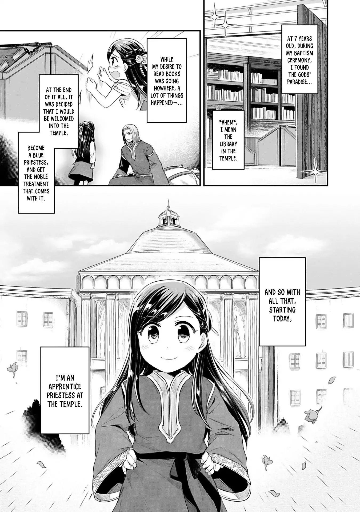
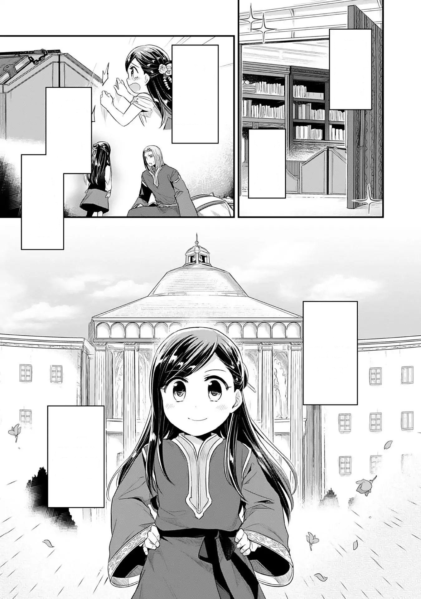
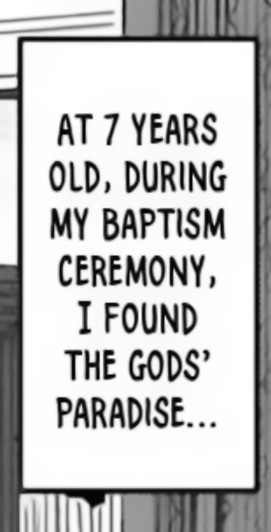

# MangaTranslationHelper

Application for extracting the texts from a manga to translate, and do a pre-quick-clean of the images

>This code is based on the work of [Rimuto](https://github.com/Rimuto) with [AutoMangaCleaner](https://github.com/Rimuto/AutoMangaCleaner)
where he provides a web application, in this case, is a command-line application that takes images from the input folder and creates the clean images
on the output folder with the bubble sections, and a translation file associated with each page.


## Pre-Requisites

- Python 3.9
- [Tesseract-OCR v5+](https://tesseract-ocr.github.io/) 
    > Required for English manga and is needed to set env variable TESSERACT_HOME or change the value from config.py PATH_TO_TESSERACT
- YOLOv4 configuration and weights
    > [Download yolov4-obj_final.weights](https://drive.google.com/drive/folders/1-Ali16MS27AQoR0lEec5Z-x8lAAle0K0) and copy on folder resources/YOLOv4


## How works?

Will search all the images from the input folder and sub-folders and will start to analyze 
with YOLOv4 weights to crop the images using CV2 after that process each bubble will be 
processed by Tesseract to generate an output file with the extracted text. 

Support manga on english and japanese. 


## How to use?

Add the images (or folder with images) from the manga that you want 
on the **_input** folder then you can run from your IDE or execute ```python main.py```

### Optional Parameters
```
usage: main.py [-h] [-o OUTPUT_FORMAT] [-l LANG] [-pi PRESERVE_ID] [-f FORCE] [-i INPUT]

optional arguments:
  -h, --help            show this help message and exit
  -o OUTPUT_FORMAT, --output-format OUTPUT_FORMAT
                        Output format. Supported: xliff, text, json | Default xliff
  -l LANG, --lang LANG  Language from image. Supported: en, jpn | Default en
  -pi PRESERVE_ID, --preserve_id PRESERVE_ID
                        Preserve id: is the filename of the bubble image | Default True
  -f FORCE, --force FORCE
                        Force to process each step of the image clean and text extraction | Default False
  -i INPUT, --input INPUT
                        filename from image locate on _input, this work to allow to process only one image instead of all inside the folder
```

## Example of use

In this example we will copy this image on the **_input** folder

<a href="resources/example/example_img.jpg"></a></br>

you will see on the console the following output
```
[INFO] YOLO took 0.352500 seconds
Complete extract_image_and_clean
Processed file 0_1045x71__clean
Processed file 1_527x124__clean
Processed file 2_131x259__clean
Processed file 3_787x402__clean
Processed file 4_53x489__clean
Processed file 5_960x944__clean
Processed file 6_133x1285__clean
Created example_img_bubbles_data.xliff
```

this will mean that in the **_output** folder you will find, the image cleaned

<a href="resources/example/example_img_cleaned.jpg"></a></br>

A folder with the bubbles extracted, and the bubbles with a post-process for allowing to tesseract to work

<a href="resources/example/bubble_org.png"></a></br>
<a href="resources/example/bubble_tessaract.png"></a></br>

And in the same level of the image a xliff file (possible to configure to generate a json or a txt) with the texts

```
<?xml version="1.0" ?>
<xliff xmlns="urn:oasis:names:tc:xliff:document:1.2" version="1.2">
   <file original="global" source-language="en-US" target-language="es">
      <body>
         <trans-unit id="0_1045x71__clean">
            <source xml:xlang="en-US">AT 7 YEARS OLD, DURING MY BAPTISM  CEREMONY, I FOUND THE GODS’ PARADISE. ..</source>
            <target xml:xlang="es"> </target>
         </trans-unit>
         
         [...]
         
      </body>
   </file>
</xliff>
```

----

## Disclaimers

- Is primary thought to be used with black and white images, with colored images is possible that not work as expected
- The clean part work for bubbles and rectangles that contain text, which means that still will be needed edition skill for images with text above
- The bubbles image can be not sorted in the exact way that is read in a manga
- The translations file can have the texts in an incorrect order because are read from the bubbles, this will need manual work to fix the file
- The translation files can have some errors like a mistake I by T or B by 8 and similar, this is typically for the font used for the training set.
- The "cleaned image" normally needs more space that the raw one and notice that each bubble image and the clean version for Tesseract can use much disk space